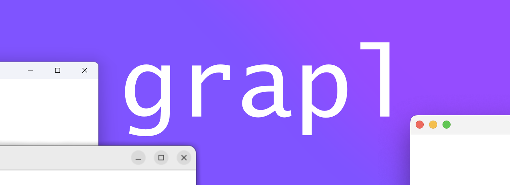

<a href="https://boosty.to/husker-dev/donate">
    
</a>

<a href="LICENSE"></a>
<a href="https://github.com/husker-dev/offscreen-jgl/releases/latest"></a>

# About

Java\Kotlin tool for managing OpenGL contexts and windows.

- [Dependency](#dependency)
- [Usage](#usage)
  - [Contexts](#contexts)
  - [Windows](#windows)

# Dependency
```groovy
dependencies {
    implementation 'com.huskerdev:grapl-gl-windows:2.1.0'
    implementation 'com.huskerdev:grapl-gl-macos:2.1.0'
    implementation 'com.huskerdev:grapl-gl-linux:2.1.0'
}
```

Available modules:
  - ```grapl``` - core library
    - ```grapl-windows```
    - ```grapl-macos```
    - ```grapl-linux```
  - ```grapl-gl``` - OpenGL module
    - ```grapl-gl-windows```
    - ```grapl-gl-macos```
    - ```grapl-gl-linux```
  - ```grapl-ext-display``` - Display extension

# Usage

Grapl can oparate OpenGL contexts separatly from window

## Contexts

- ```kotlin
  val context = GLContext.create(..)
  ```
  Creates new opengl context with requesterd parameters (doesn't make current)

  - ```shareWith``` - Shared context handle
      - ***type***: GLContext/Long
      - **default**: 0L
  - ```coreProfile``` - Core/Compatibility profile
      - ***type***: GLProfile
      - **default**: GLProfile.CORE
  - ```majorVersion``` - Requested major version
      - ***type***: Int
      - **default**: -1
  - ```minorVersion``` - Requested minor version
      - ***type***: Int
      - **default**: -1


- ```kotlin
  context.makeCurrent()
  ```
  Makes context current in running thread


- ```kotlin
  context.delete()
  ```
  Deletes context (does not require to be current)

## Windows

Example usage:
```kotlin
GLWindow().apply {
    title = "My application"
    size = 100 x 100
    alignToCenter()

    eventConsumer = windowEventConsumer {
        onInit {
            swapInterval = 1
            GL.createCapabilities()
            glClearColor(1f, 0f, 1f, 1f)
        }
        onUpdate {
            glClear(GL_COLOR_BUFFER_BIT)
            swapBuffers()
        }
    }

    keyTypedListeners += { e ->
        println("key typed: ${e.key.char}")
    }

    visible = true
}
```

To take control of window event handling:
```kotlin
// Disable built-in message handling
BackgroundMessageHandler.useHandler = false

val window = GLWindow().apply {
    size = 100 x 100
    alignToCenter()
    visible = true
}

// Handle events
while(!window.shouldClose)
    Window.waitMessages() // or peekMessages

```
